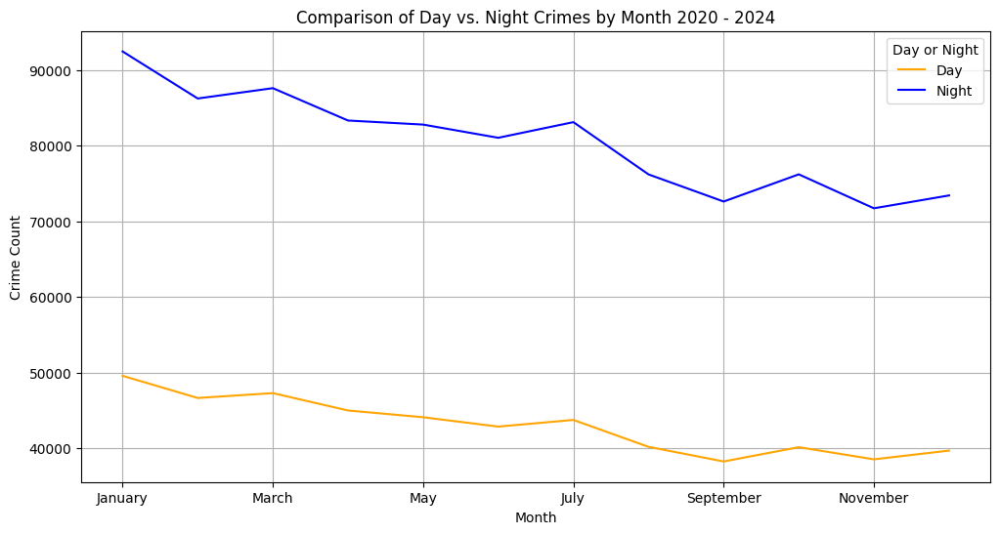
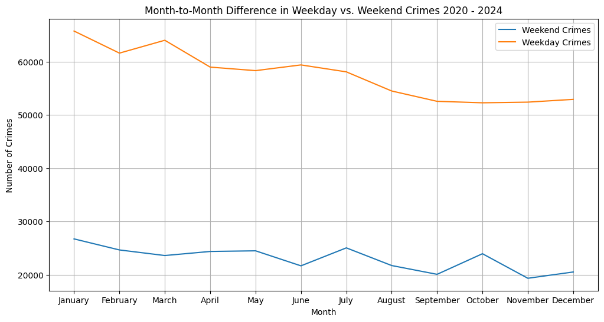
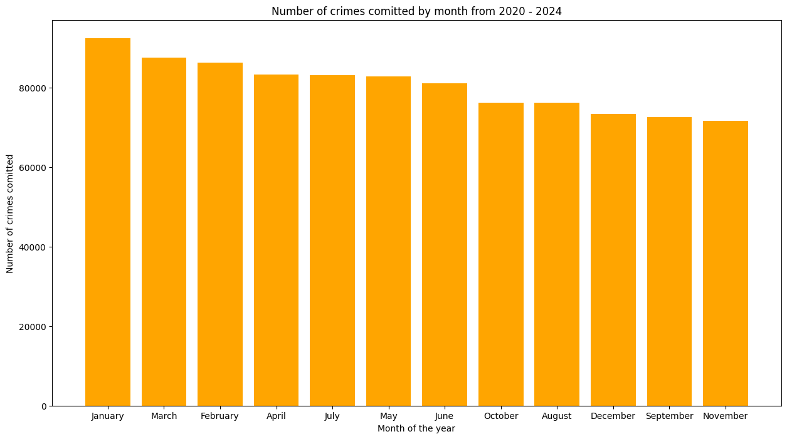

# Data_Project_1
## By Jesus Amador,Rekha Puthalpet, Kuautli Rojas & Carl Mini

## Introduction
To analyze the crime dataset to identify trends, correlations, and patterns that can provide insights into crime rates, types, and distribution across different regions or time periods. The goal is to use this analysis to inform policy-making, improve law enforcement strategies, and enhance public safety.

## Crime Rate Trends
Analyzing the trends of crimes committed during the time frame from 202 to 2024. When analyzing the trends we see that most crimes are committed on a weekday compared to the weekend. While the "most popular" day to committ a crime was Friday. We can also see that the mojority of crimes are committed earlier in the year with Janurary being the hottest month for crime. We can also see from the data that most of the crimes committed during the years took place at night, between the hours of 6 pm and 6 am.

Day vs Night crime counts

Weekday vs weekend trends

Number of crimes committed by month from 2020 - 2024

## Crime Type Distribution
- Break down the data by crime type to determine the most and least common crimes.
- Analyze trends within specific crime types (e.g., an increase in cybercrime over the years).

## Geographical Analysis
Examine the relationship between Geographical location and crime rates.
 ###  Crime Distribution:
 Using tools like hvplot and heat map, crime incidents were mapped to visualize their distribution across the city.
 
 
 ### Comparison of crime rates across neighborhoods.
 Findings: The analysis of top 10 neighbrhoods with highest and lowest cirmes.
 
 
 ### Correlation with 

 ### Challenges and Resolutions
 
 ### Key Results: 
 The geographical analysis successfully identified high-crime areas, correlated crime types with specific locations.
 ### Conclusions: 
 The findings support the need for targeted interventions in high-crime areas. 
## Demographic Analysis
 Examine the relationship between demographic factors (e.g., age, gender, descent) and crime rates.
### Can the data provide provide some insight if certain demographics are likely to be a victim of a crime? 
GENDER : The city's gender break down according to [U.S. Census Bureau American Community Survey](https://www.neilsberg.com/insights/los-angeles-ca-population-by-gender/) shows just about an even split giving males a slight edge at 50.01% and females 49.99%.  Our analysis on victim data shows that males are at 47.1% and females at 41.9%.  This does appear to demonstrate that males have a sligtly higher chance of being a victim of a crime.
    

Age - The analysis was conducted by grouping victims into age groups, which provided a clearer overview of the data compared to analyzing each age individually. By also breaking down the data by gender, we were able to look for patterns where age and gender might come into play. When comparing the victim numbers with the city's population distribution by [age](https://www.neilsberg.com/insights/topic/los-angeles-ca-population/), we found that the proportions of victims closely mirror the age demographics of the city. Since these age groups constitute a larger share of the population, it is expected that the victim numbers would align with this distribution.

Race - The final demographic factor analyzed was race. Similar to age, the victim data closely mirrored the city's [racial](https://ctsi.ucla.edu/los-angeles-county-diversity) demographics. Hispanics, being the largest ethnic group in the city, also had the highest number of victims, followed by the White racial group. However, the data reveals an interesting observation. While Asians make up 11.72% of the population and Black/African Americans 8.63%, the victim percentages differ: Black/African Americans account for 15.99% of total victims, whereas Asians are at 4.56%. This suggests that victim numbers do not always align with the city's demographic makeup, indicating that other factors contribute to this disparity.

## Analyzing the distribution of crime types in your dataset can provide several insights into the nature of crime within the area or timeframe covered by the data. Here are some key findings you might infer:

## Prevalence of Crime Types:

- Top Crimes: The most common crime type is "VEHICLE - STOLEN" at 11.1%. This indicates that a significant proportion of crimes fall into these categories.
- High-Percentage Crimes: Categories like "BATTERY - SIMPLE ASSAULT" (7.7%) and "BURGLARY FROM VEHICLE" (6.2%) also represent substantial portions of the crime data.
- Crime Categories with Lower Incidence:
Crimes like "VIOLATION OF RESTRAINING ORDER" (1.2%) and "BRANDISH WEAPON" (1.5%) are less common, suggesting they occur less frequently relative to other types.
- Property Crimes: Categories such as "BURGLARY FROM VEHICLE" (6.2%), "THEFT OF IDENTITY" (6.2%), and various theft-related crimes suggest that property crimes are a significant concern.
- Violent Crimes: Categories such as "BATTERY - SIMPLE ASSAULT" (7.7%) and "ASSAULT WITH DEADLY WEAPON, AGGRAVATED ASSAULT" (5.5%) indicate that violent crimes also contribute notably to the crime data.
- Trends in Theft:
Different theft categories, including "THEFT OF IDENTITY," "THEFT FROM MOTOR VEHICLE," and "SHOPLIFTING - PETTY THEFT," show a diverse range of theft-related incidents. This indicates that theft is a major issue with various subcategories.
- Vandalism Insights:
Vandalism-related crimes, including both felony and misdemeanor categories, make up a noticeable portion of the data, suggesting that vandalism is a recurring issue.
- Special Crime Types:
Vehicle-related Crimes: "VEHICLE - STOLEN" and "BURGLARY FROM VEHICLE" highlight concerns related to vehicle theft and burglary.
- Assaults: The data shows that different types of assaults, from simple to aggravated, are prevalent.
- Overall Crime Distribution:
- Diverse Crime Types: The variety in crime types suggests a complex crime landscape with multiple issues needing different strategies for prevention and intervention.
- Resource Allocation: Focus on high-frequency crime types like vehicle theft and battery might be necessary for law enforcement and community safety efforts.
- Prevention Programs: Developing targeted prevention programs for property crimes and violent crimes based on their prevalence can be effective.
- Community Awareness: Raising awareness about common crime types and preventive measures can help reduce incidents, particularly in categories with high percentages.
By examining these insights, policymakers, law enforcement agencies, and community organizations can tailor their strategies to address the most prevalent issues and work toward reducing crime rates effectively.

## Crime by Area:
- Areas with higher crime counts like 'Central' and '77th Street' may require more focused crime prevention and law enforcement resources.
- Areas with lower crime counts like 'Foothill' might need different strategies or could be used as models for successful crime reduction.
- Crime Type Distribution:
Understanding which crimes are most common can help in prioritizing police efforts and community programs.
Crime types with high percentages, such as theft or assault, may indicate where interventions should be concentrated.

## Crime Type Distribution by Victim Sex:
- High Incidence by Gender: You can see which crime types are more prevalent among different sexes. For instance, if a particular crime type is predominantly reported by one sex, it may indicate targeted crime prevention efforts or societal issues.
- Comparison: Helps in understanding if certain crimes disproportionately affect a particular gender.
- Patterns and Insights:
- Victimization Trends: Identifying trends can lead to better resource allocation and tailored interventions.
- Policy Implications: Data showing significant disparities may influence policy decisions and community support programs.

## Age Distribution Trends:
- Average Age Variation: By examining the average victim age across different crime types, you can identify which crimes tend to affect younger or older victims on average.
- Target Demographics: Helps in understanding if certain types of crimes are more prevalent among specific age groups.
- Resource Allocation:
- Tailored Interventions: If certain crimes disproportionately affect a particular age group, resources and prevention strategies can be tailored accordingly.
- Policy and Prevention Strategies:
Focus Areas: Helps in developing age-specific crime prevention programs and policies to address the needs of the most affected age groups.

